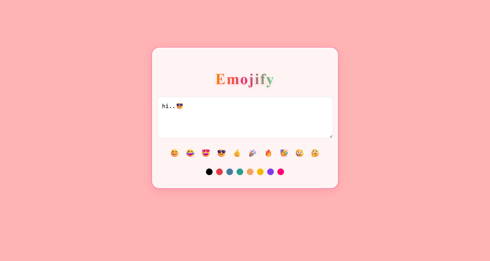

# Emojify

## Project Description
Emojify is a fun and interactive web application that allows users to enhance their text messages with colorful emojis and background colors. The app provides an easy-to-use interface for selecting emojis and customizing the appearance of your messages.

## How It Works
1. Enter your message in the input field.
2. Choose your favorite emojis using the emoji buttons.
3. Select a color using the color buttons to change the text color.
4. Your message will be displayed with the selected emojis and color.

## Technologies Used
- React
- Vite
- JavaScript
- CSS

## Screenshot
Below is a screenshot of the Emojify application:

